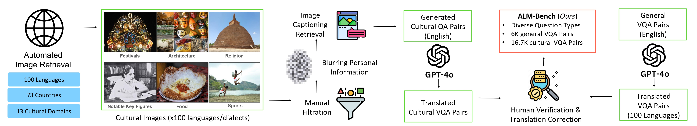
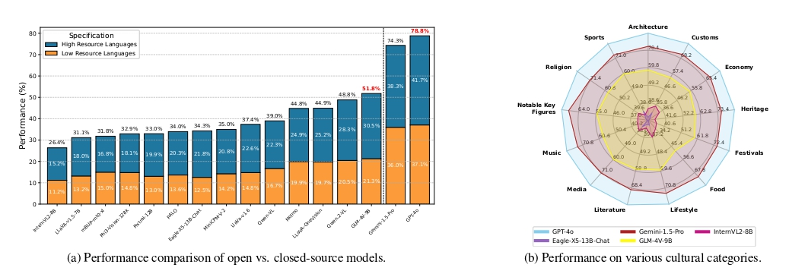
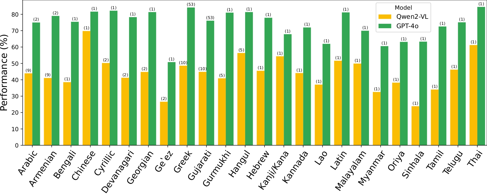
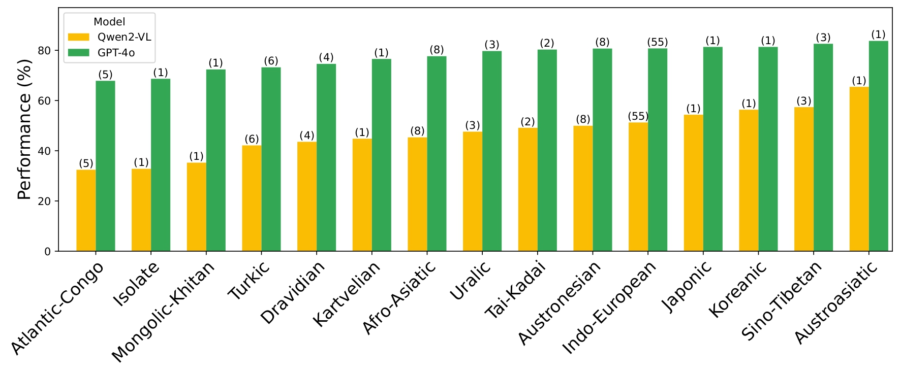

# All Languages Matter: Evaluating LMMs on Culturally Diverse 100 Languages

<p align="center">
    
</p>
<p align="center">
   <a href="https://github.com/mbzuai-oryx/MobiLlama/blob/main/LICENSE"></a>
</p>

> #### [Ashmal Vayani](https://scholar.google.com/citations?user=K4KF1SwAAAAJ&hl=en&oi=ao)<sup>♠</sup>, [Dinura Dissanayake](https://scholar.google.com/citations?user=HVIV99gAAAAJ&hl=en)<sup>♠</sup>,[Hasindri Watawana](https://scholar.google.com/citations?user=HJY3MFMAAAAJ&hl=en&oi=ao)<sup>♠</sup>, [Noor Ahsan]()<sup>♠</sup>, [Nevasini Sasikumar]()<sup>♠</sup>, [Omkar Thawakar](https://scholar.google.com/citations?user=flvl5YQAAAAJ&hl=en)<sup>♠</sup>, [Henok Biadglign Ademtew](), [Yahya Hmaiti](), [Amandeep Kumar](), [Kartik Kuckreja](), [Mykola Maslych](), [Wafa Al Ghallabi](), [Mihail Mihaylov](), [Chao Qin](), [Abdelrahman M Shaker](), [Mike Zhang](), [Mahardika Krisna Ihsani](), [Amiel Esplana](), [Monil Gokani](), [Shachar Mirkin](), [Harsh Singh](), [Ashay Srivastava](), [Endre Hamerlik](), [Fathinah Asma Izzati](), [Fadillah Adamsyah Maani](), [Sebastian Cavada](), [Jenny Chim](), [Rohit Gupta](), [Sanjay Manjunath](), [Kamila Zhumakhanova](), [Feno Heriniaina Rabevohitra](), [Azril Amirudin](), [Muhammad Ridzuan](), [Daniya Kareem](), [Ketan More](), [Kunyang Li](), [Pramesh Shakya](), [Muhammad Saad](), [Amirpouya Ghasemaghaei](), [Amirbek Djanibekov](), [Dilshod Azizov](), [Branislava Jankovic](), [Naman Bhatia](), [Alvaro Cabrera](), [Johan Obando-Ceron](), [Olympiah Otieno](), [Fabian Farestam](), [Muztoba Rabbani](), [Sanoojan Baliah](), [Santosh Sanjeev](), [Abduragim Shtanchaev](), [Maheen Fatima](), [Thao Nguyen](), [Amrin Kareem](), [Toluwani Aremu](), [Nathan Xavier](), [Amit Bhatkal](), [Hawau Toyin](), [Aman Chadha](https://scholar.google.com/citations?user=gPGQuBQAAAAJ&hl=en&oi=ao)<sup>♠</sup>, [Hisham Cholakkal](https://scholar.google.com/citations?hl=en&user=bZ3YBRcAAAAJ)<sup>♠</sup>, [Rao Muhammad Anwer](https://scholar.google.com/citations?hl=en&authuser=1&user=_KlvMVoAAAAJ)<sup>♠</sup>, [Michael Felsberg](https://scholar.google.com/citations?user=lkWfR08AAAAJ&hl=en)<sup>♠</sup>, [Jorma Laaksonen](https://scholar.google.com/citations?user=qQP6WXIAAAAJ&hl=en&oi=ao)<sup>♠</sup>, [Thamar Solorio](https://scholar.google.com/citations?user=Gmjwy-IAAAAJ&hl=en&oi=ao)<sup>♠</sup>, [Monojit Choudhury](https://scholar.google.com/citations?user=WR1ImCMAAAAJ&hl=en&oi=ao)<sup>♠</sup>, [Ivan Laptev](https://scholar.google.com/citations?user=-9ifK0cAAAAJ&hl=en&oi=ao)<sup>♠</sup>, [Mubarak Shah](https://scholar.google.com/citations?user=p8gsO3gAAAAJ&hl=en&oi=ao)<sup>♠</sup>, [Salman Khan](https://salman-h-khan.github.io/)<sup>♠</sup>, and [Fahad Khan](https://sites.google.com/view/fahadkhans/home)<sup>♠</sup>

#### <sup>♠</sup> Core Authors
#### University of Central Florida, Mohamed bin Zayed University of AI, Amazon, Aalto University, Australian National University, Linköping University

[](https://arxiv.org/abs/2411.16508)
[](https://huggingface.co/datasets/MBZUAI/ALM-Bench)
[](https://mbzuai-oryx.github.io/ALM-Bench/)

Official GitHub repository for  `All Languages Matter: Evaluating LMMs on Culturally Diverse 100 Languages`.

---

## 📢 Latest Updates
- **Nov-25-24**- *Arxiv* Preprint is released! 🔥🔥
- **Nov-20-24**- *ALM-Bench Dataset* and codes are released. It provides 22,763 human-annotated multimodal QA pairs across 19 categories to extensively evaluate the performance of LMMs. 🔥🔥

---

## 🏆 Highlights


> <p align="justify"> <b> <span style="color: blue;">Figure</span></b>: ALM-bench comprises a diverse set of 100 languages with manually verified annotations by respective native language experts. Here, qualitative examples highlight the comprehensive set of 13 cultural aspects covered in the benchmark, such as heritage, customs, architecture, literature, music, and sports. It also evaluates visual understanding for six generic aspects. The ALM-bench focuses on low- resource languages and different regions, spanning 73 countries across five continents and 24 distinct scripts. ALM-bench covers diverse questions, such as multiple choice questions (MCQs), true/false (T/F), short and long visual question answers (VQAs).

> **<p align="justify"> Abstract:** Existing Large Multimodal Models (LMMs) generally focus on only a few regions and languages. As LMMs continue to improve, it is increasingly important to ensure they understand cultural contexts, respect local sensitivities, and support low-resource languages, all while effectively integrating corresponding visual cues. In pursuit of culturally diverse global multimodal models, our proposed All Languages Matter Benchmark (`ALM-bench`) represents the largest and most comprehensive effort to date for evaluating LMMs across 100 languages. `ALM-bench` challenges existing models by testing their ability to understand and reason about culturally diverse images paired with text in various languages, including many low-resource languages traditionally underrepresented in LMM research. The benchmark offers a robust and nuanced evaluation framework featuring various question formats, including true/false, multiple choice, and open-ended questions, which are further divided into short and long-answer categories. `ALM-bench` design ensures a comprehensive assessment of a model’s ability to handle varied levels of difficulty in visual and linguistic reasoning. To capture the rich tapestry of global cultures, `ALM-bench` carefully curates content from 13 distinct cultural aspects, ranging from traditions and rituals to famous personalities and celebrations. Through this, `ALM-bench` not only provides a rigorous testing ground for state-of-the-art open and closed-source LMMs but also highlights the importance of cultural and linguistic inclusivity, encouraging the development of models that can serve diverse global populations effectively. Our benchmark and codes are publicly available. </p>

## ALM-Bench assesses the multilingual multimodal models towards better cultural understanding and inclusivity.

**Main contributions:**
1) **All Languages Matter Benchmark (ALM-Bench):** We introduce ALM-bench, a culturally diverse multilingual and multimodal VQA benchmark covering 100 languages with 22.7K question-answers. ALM-bench encompasses 19 generic and culture-specific domains for each language, enriched with four diverse question types.
2) **Extensive Human Annotation:** ALM-bench is meticulously curated and verified with native-language experts (over 800 hours of human annotators), ensuring cultural relevance and accuracy across low- and high-resource languages alike.
3) **Comprehensive Evaluation:** We benchmark existing LMMs on the ALM-bench, identifying performance gaps and areas for improvement, especially in culturally complex multilingual scenarios. 

<hr />

## 🗂️ Dataset

<p align="center">
   </a>
</p>


> <p align="justify"> <b> <span style="color: blue;">Table</span></b>: Comparison of various LMM benchmarks with a focus on multilingual and cultural understanding. The Domains indicate the range of aspects covered by the dataset for each language. Question Form is categorized as "Diverse" if the questions phrasing varies, and "Fixed" otherwise. Annotation Types are classified as "Manual" if questions were originally in the local language, "Manual+Auto" if questions were generated or translated using GPT-4/Google API and subsequently validated by human experts, and "Auto" if generated or translated automatically without human validation. Bias Correction reflects whether the dataset is balanced across cultures and countries, while Diversity indicates whether the dataset includes both Western and non-Western minority cultures. ‘-’ means information not available. </p>

<hr />

## 🔍 Dataset Annotation Process

> <p align="justify"> <b> <span style="color: blue;">Figure</span></b>: Data collection and verification pipeline. Our benchmark features both cultural specific content sourced from the web (left) and generic image understanding collection sourced from existing LMM benchmark. The cultural part is carefully filtered to remove noisy samples and private information. We use GPT4o for translations which are manually verified and corrected with over 800 hours of human annotators (native speakers). Our ALM-bench has diverse question types and features approximately 23K QA pairs in total in 100 languages. </p>

<hr />

## 📊 Results

The below Heatmap presents the evaluation results of 16 recent LMMs including 14 open- and 2 closed-source LMMS on all 100 languages on the 19 categories of the ALM-Bench dataset.

<p align="center">
   </a>
</p>

### ⚖️ Cultural Categories and Open-Sourced vs Close-Sourced LMM Performance

> <p align="justify"> <b> <span style="color: blue;">Figure</span></b>: Benchmarking LMMs on diverse languages & cultures: <b><span style="color: blue;">(a)</span></b> Performance of various open versus closed-sourced LMMs on ALM-bench. For each LMM, we also report performance on low versus high-resource languages. All these carefully selected models were released after 2023. <b><span style="color: blue;">(b)</span></b> Performance of high-performing LMMs on our culturally curated 13 categories available in our ALM-bench. </p>

### Different prompting techniques

We study the performance of various LMMs with and without additional country location information. Proprietary models show a notable performance boost of 2.6% to 5% when location-aware prompts are used, while open-source models exhibit a marginal improvement. 

| Models | With Country Info. | Without Country Info.| 
|--------|--------------------|----------------------|
| GPT-4o | 83.57%             | 80.96%               |
| Gemini-1.5-Pro | 81.52%     | 76.19%               |
| GLM-4V-9B | 56.78%          | 56.41%               |
| Qwen2-VL | 53.97%           | 52.57%               |


### Performance on different language scripts

We demonstrate the performance comparison of GPT-4o and Qwen2-VL on different language scripts. We highlight that both the GPT-4o and Qwen2-VL struggle particularly on low-resource scripts such as, Ge’ez (Amharic), Sinhalese (Sinhala), Oriya (Odia), and Myanmar (Myanmar-Burmese).




### Performance on different language families

We show the performance comparison of GPT-4o and Qwen2-VL on 15 language families. Results show that performance on several African (Atlantic-Congo) languages such as Igbo, Kinyarwanda, Shona, Swahili, and Yoruba is inferior compared to several Asian (e.g., Chinese, Korean, Vietnamese) and Western languages (e.g., English, French, German).



<hr />

## 🤖 Qualitative Success and Failure cases

> <p align="justify"> <b> <span style="color: blue;">Figure</span></b>: We present the qualitative examples of the success cases in the first row and failure cases of GPT-4o in the second row on different languages & domains in ALM-bench. For the failure cases, we specify different error types. For instance, the Urdu language question asks about the festival depicted in the image. The image specifically refers to Mela Chiraghan (Festival of Lights), a celebration held in honor of the Sufi saint Shah Jamal’s shrine. Since the decoration in the image closely resembles that of Eid Milad un Nabi — another religious festival—the model erroneously associates it with this wrong event. This constitutes a lack of cultural understanding since the model fails to distinguish between the theme behind the decorations. Eid Milad un Nabi typically features more modest, reverential lighting with green lights, whereas the lighting in Mela Chiraghan is brighter and more colorful. Additionally, people typically dress for the Eid Milad un Nabi event in a traditional outfit which is absent in the image. These examples highlight the model’s gap in cultural knowledge and its limitations in terms of accurately interpreting the cultural context of the given sample. 

<hr />

## 🚀 Getting started with ALM-Bench

### Downloading and Setting Up ALM-Bench Dataset
ALM-Bench dataset can be downloaded from our [huggingface](https://huggingface.co/datasets/MBZUAI/ALM-Bench). ALM-Bench consists of 22,763 question-answer (QA) pairs spanning over 100 languages and 19 categories. The general structure of our dataset looks like the following:

```
ALM-Bench/
|–– Swedish/
|   |–– Religion
|   |–– Culture
|   |–– Heritage
|   |–– ... # remaining categories
... # remaining languages
```

Data Fields
```
- 'file_name': , 
- 'ID': A unique ID in the language#_cat#_img# format. 
- 'Language': A language from the 100 languages.
- 'Category': A category from our total 19 categories.
- 'Question_Type': One of four question types, MCQs, T/F, SVQAs, and LVQAs.
- 'English_Question': The original question in the English Language.
- 'English_Answer': The original answer in the English Language.
- 'Translated_Question': The translated and annotated question in the Native language. 
- 'Translated_Answer': The translated and annotated answer in the Native language. 
- 'Image_Url': The image URL that we have retrieved from the internet.
```

### Evaluating LMMs on ALM-Bench Dataset
To evaluate Video-LMMs on the ALM-Bench, please follow the following steps:

#### 0) Installation
Follow the instructions in [INSTALL.md](https://github.com/mbzuai-oryx/ALM-Bench/blob/main/Assets/INSTALL.md) to install packages and model weights required to run the sample Video-LMM codes for evaluation. 

#### 1) Comparing the Predicted Answers with Ground-Truth Answers using LLM-Assisted evaluation:
Once the answer predictions are generated from step 1, we utilize LLM as a Judge to measure/quantify the correctness of LMM prediction for each question in the ALM-Bench. Please follow the instructions in LLM_SCORING.md for using LMM-Assisted evaluation.

## 🧩 Additional Assets for LLM-based QA generation process:

#### Generating LLM-based question-answer pairs from images from our cultural categories:

The first version of the ALM-Bench dataset is already finalized. However, for additional reference, we are providing code snippets alongside LLM prompts that we used to generate the initial set of QA pairs.

Please refer to [QA_GENERATION.md]() for instructions and sample code on generating question-answer pairs for CVRR-ES videos using LLM.

<hr />

## 📂 License
This work is licensed under a Creative Commons Attribution-NonCommercial-ShareAlike 4.0 International License. The images in ALM-Bench dataset are collected from public domains and sources (refer to [main paper](https://arxiv.org/) for more details) and are for academic research use only. 
By using ALM-Bench, you agree not to use the dataset for any harm or unfair discrimination. Please note that the data in this dataset may be subject to other agreements. Video copyrights belong to the original dataset providers, video creators, or platforms.

## 📜 Citation
If you find our work and this repository useful, please consider giving our repo a star and citing our paper as follows:
```bibtex
@misc{vayani2024languagesmatterevaluatinglmms,
      title={All Languages Matter: Evaluating LMMs on Culturally Diverse 100 Languages}, 
      author={Ashmal Vayani and Dinura Dissanayake and Hasindri Watawana and Noor Ahsan and Nevasini Sasikumar and Omkar Thawakar and Henok Biadglign Ademtew and Yahya Hmaiti and Amandeep Kumar and Kartik Kuckreja and Mykola Maslych and Wafa Al Ghallabi and Mihail Mihaylov and Chao Qin and Abdelrahman M Shaker and Mike Zhang and Mahardika Krisna Ihsani and Amiel Esplana and Monil Gokani and Shachar Mirkin and Harsh Singh and Ashay Srivastava and Endre Hamerlik and Fathinah Asma Izzati and Fadillah Adamsyah Maani and Sebastian Cavada and Jenny Chim and Rohit Gupta and Sanjay Manjunath and Kamila Zhumakhanova and Feno Heriniaina Rabevohitra and Azril Amirudin and Muhammad Ridzuan and Daniya Kareem and Ketan More and Kunyang Li and Pramesh Shakya and Muhammad Saad and Amirpouya Ghasemaghaei and Amirbek Djanibekov and Dilshod Azizov and Branislava Jankovic and Naman Bhatia and Alvaro Cabrera and Johan Obando-Ceron and Olympiah Otieno and Fabian Farestam and Muztoba Rabbani and Sanoojan Baliah and Santosh Sanjeev and Abduragim Shtanchaev and Maheen Fatima and Thao Nguyen and Amrin Kareem and Toluwani Aremu and Nathan Xavier and Amit Bhatkal and Hawau Toyin and Aman Chadha and Hisham Cholakkal and Rao Muhammad Anwer and Michael Felsberg and Jorma Laaksonen and Thamar Solorio and Monojit Choudhury and Ivan Laptev and Mubarak Shah and Salman Khan and Fahad Khan},
      year={2024},
      eprint={2411.16508},
      archivePrefix={arXiv},
      primaryClass={cs.CV},
      url={https://arxiv.org/abs/2411.16508}, 
} 
```

## 📨 Contact
If you have any questions, please create an issue on this repository or contact at ashmal.vayani@ucf.edu.


## 🙏 Acknowledgements

This repository has borrowed Video-LMM evaluation code from [TimeChat](https://github.com/RenShuhuai-Andy/TimeChat) and [LLaMA-VID](https://github.com/dvlab-research/LLaMA-VID). We also borrowed partial code from [Video-ChatGPT](https://github.com/mbzuai-oryx/Video-ChatGPT) and [CVRR-Evaluation-Suit](https://github.com/mbzuai-oryx/CVRR-Evaluation-Suite) repository. We thank the authors for releasing their code.

---
[](https://www.crcv.ucf.edu/)
[](https://www.ival-mbzuai.com)
[](https://github.com/mbzuai-oryx)
[](https://mbzuai.ac.ae)
